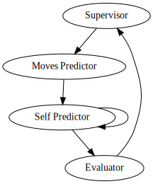

## An Idea for a Generally-Intelligent Reinforcement Learning Agent

### Introduction

Stockfish is [one of](https://en.wikipedia.org/wiki/Top_Chess_Engine_Championship#Tournament_results_
%28TCEC%29) the best chess engines of all time. Magnus Carlsen is often said to be the best chess player of
all time. If Carlsen were to play Stockfish at chess, Stockfish would win [by a landslide](https://www.quora
.com/Can-Magnus-Carlsen-draw-Stockfish). If they were to play draughts, not only would Carlsen win, but
Stockfish would not be able to understand the problem: chess has fundamental features not shared by draughts.
So to create an agent capable of playing both games, we would need to find shared features; this process
would be repeated with new games, finding more fundamental shared features. Over time, fewer features
constrain it, and eventually, with enough games considered, the agent will be able to be trained to play any
game considered in its development (and more!).  

So, what are the shared features of chess and draughts? At any time, the agent gets a view of the state of
the system and a set of legal moves, the playing of any of which changes the state of the system in some
way. This happens to the other agent, and is repeated until the state of the system follows some particular
pattern, at which point either one of the players has won or the result is a draw (this covers most
turn-based games, not just chess and draughts).  

### The Agent

> "The intelligence of a system is a measure of its skill-acquisition efficiency over a scope of tasks with
respect to priors, experience, and generalization difficulty." - F. Chollet, *On the Measure of Intelligence*

By this definition (which we will be using throughout this post), an intelligent agent must be able to learn
to manipulate various unrelated systems to achieve some goal, and to transfer its abilities from one system
to another, with as little training data as possible. To manage its knowledge of these systems, the agent
must have a controlling part, known hereafter as the *supervisor*. The parts controlled by the supervisor will
be called *system agents*.  

From this, we can approximate an architecture:

In order for the system agents to learn, they must be given data from the environment. They will then pass on
their evaluation of each legal move to the supervisor, which will act on it. This evaluation is performed by
the system agent predicting the evolution of the game, first with a given move, then with a neural net trained
to predict the state after the supervisor has acted, before passing it through a neural net trained on pairs of
states and the sum of the outcome of the game divided by the number of states in the game and the original
evaluation of the state (this will be explained more later; it's hard to describe math in English).

So, the architecture of a single system agent is:

Specifically, a system will be defined as a cluster of points in the latent space of an autoencoder trained on
states previously observed by the supervisor. So if the encoded form of an input is placed in cluster $n$, the
input will be passed to system agent $n$ for analysis. If a new cluster is made, the system agent for the
nearest cluster is duplicated and assigned the new cluster. In this way, the agent's understanding of the world
in which it lives is constantly being updated and its actions optimised.  

Just as these system agents learn to win in specific systems, the supervisor uses the system agents to maximise
some function of the environment (the *utility function*).

### The Utility Function

The vagueness of the agent's description is both positive and daunting: the agent can do whatever you want,
but you have to tell it what you want. [One idea](https://arxiv.org/abs/0812.4360) is to maximise the
world-compression ratio through exploration, which Juergen Schmidhuber claims would lead to the agent
having subjective experiences (of course, this would have major moral implications, but we are concerned
only with the engineering of such an agent). Schmidhuber explains the method of exploration in the paper
linked, and I highly recommend you read it.  

The utility function will be maximised by the agent having an evaluator and predictor similar to those of
the system agents; both will be updated after each time step, since the utility function should be able to
be calculated at any time.  

Aside from being difficult, choosing a utility function [is also dangerous](https://intelligence.org/2016/12
/28/ai-alignment-why-its-hard-and-where-to-start/). A famous example of this is the Paperclip Maximiser, a
thought experiment in which a superintelligent AI is told to maximise the number of paperclips in the world.
Initially, this sounds harmless (if a little useless) - you may imagine that the agent would raise money to
create factories dedicated to the production of paperclips, perhaps acting similarly to an entrepreneur. But
the utility function (i.e. the number of paperclips) does not take into account the importance of human
life; though the agent will not necessarily harm humans, it would do so if it helped to creaate paperclips.
So, it isn't unreasonable to imagine it creating paperclips at the the cost of human civilisation, given
enough power and intelligence.

A proposed fix is [Asimov's Three Laws of Robotics](https://en.wikipedia.org/wiki/Three_Laws_of_Robotics),
which state that:
1. A robot must not harm humans (through action or inaction).
2. A robot must obey humans (unless doing so would break Law 1).
3. A robot must protect itself (unless doing so would breaks Laws 1 or 2).  

While these laws are okay for agents with small goals, they become problematic for agents with more serious
goals
