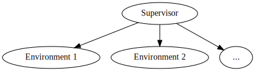

## An Idea for a Generally-Intelligent Reinforcement Learning Agent

### Introduction

> "The intelligence of a system is a measure of its skill-acquisition efficiency over a scope of tasks with
respect to priors, experience, and generalization difficulty." - F. Chollet, *On the Measure of Intelligence*

By this definition (which we will be using throughout this post), an intelligent agent must be able to learn
to manipulate various unrelated systems to achieve some goal, and to transfer its abilities from one system
to another, with as little training data as possible. To manage these areas, the agent must have a
controlling part (known hereafter as the *supervisor*). From this, we can approximate an architecture:

