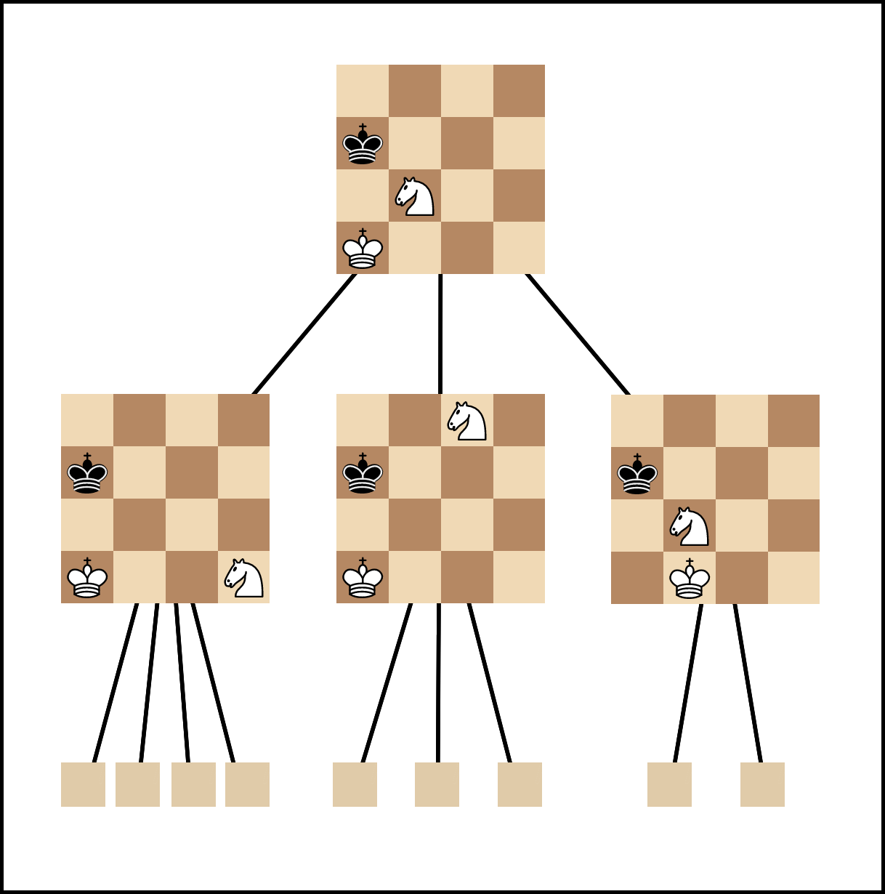

## Measuring the Effect of Pruning Algorithms on the Performance of a Chess Engine

---

### 1. Intro

Chess is a turn-based strategy board game for two players, taking place on a
grid. On a player's turn, they move one piece according to the rules of how that
piece can move – for example, the *rook* can move in straight horizontal or
vertical lines of any length, while the *king* can move one square in any
direction. However, knowledge of the specific rules of the game are not
necessary for understanding this project, and so I will not go through them all
here: just know that on each turn there are many possible moves the player can
make, and their ultimate goal is to trap their opponent's king, winning the
game. If there reaches a point in the game where it will be impossible for
either player to win, then the game ends as a draw.

In the early 20th century, people began creating machines that could play
chess, in some instances[^1] better than humans. These have improved in design
over time, and now chess engines (computers that play and analyse chess games)
are consistently far better than humans. One issue faced by all modern chess
engines is the amount of time it takes the engine to decide which move to make.
Various attempts have been made to speed this process up, and in this project
we will compare the effects of two of the most popular methods.

The next section provides an outline of how a basic chess engine works and what
can be done to speed them up.

### 2. The Structure of a Chess Engine

There are two main components of a chess engine, namely the *evaluation
function* and the *minimax search* (both explained below). An engine is
just a program that runs the minimax search with the evaluation function and
plays the resulting move.

An evaluation function is just a mathematical formula that takes in a chess
position and outputs a number representing which player it thinks is winning.
0 indicates an equal position, while a positive number means white is
winning, and a negative number means black is winning. So, for example, if a
position is evaluated as +1.2 then the engine believes white is winning
(by a good amount). This function gets better at guessing who is winning over
time by playing many thousands of games and observing their results. This need
for the engine to train is where the issue of speed comes up, but we will
explore this further in a later section.

The minimax search is the process by which the engine decides the best move
given a position. It does this by playing each possible move in the current
position, and then each possible move in each resulting position, and then each
possible move in the positions resulting from those, and so on, looking a
certain number of moves ahead. It then evaluates each position with the
evaluation function and chooses the move that will lead to the best position
long-term, assuming both it and its opponent play the best moves it can find
for them. This also contributes to the amount of time taken to find the best
move: the number of positions that must be evaluated in order to choose a move
increases exponentially as we increase the search depth – that is, the number
of moves ahead the engine plans. There are, on average, about 30 moves
that can be made in any position. So, looking 4 moves ahead, this means 
the engine has to evaluate about 810,000 positions to find the best
move. It takes time to run the evaluation function, and in evaluating 810,000
positions this time adds up.

Given that there are two parts to an engine, there are two ways we can try to
speed the engine up. The evaluation function is really just a lot of
multiplication and addition, both of which are extremely fast on computers
already. So, we will look at speeding up the minimax search. This requires
limiting the number of positions the engine evaluates, a process known as
*pruning*[^2]. The specific pruning methods we will use are discussed in the
next section.

### 3. The Pruning Algorithms

The most popular pruning algorithm[^3] for chess engines is *alpha-beta*
pruning. Another popular algorithm is *ProbCut*, which is based upon alpha-beta
but is theoretically faster.

An engine using alpha-beta pruning starts the search normally, playing
hypothetical moves and evaluating the resulting positions. During this process,
however, it will find that some moves will guarantee positions of a
higher evaluation than others. For example, consider a situation in which the
engine is considering two moves, \\( A \\) and \\( B \\): move \\( A \\) will
lead to good positions for the engine, whereas move \\( B \\) will lead to a
position in which the opponent is able to eventually win the game. As long as
just one branch of the tree from move \\( B \\) leads to the opponent winning,
it is assumed that the opponent will find this and therefore move \\( B \\) does
not need to be considered. This concept is constantly applied: if a move is
guaranteed to be worse than an already-searched move, then it is not considered.
By ignoring a branch, the number of positions that need to be evaluated is
reduced, and so the total time needed to perform the minimax search is reduced
as a result.

ProbCut is based upon the idea that the result of a search with a low depth works
as a rough estimate of a search with a high depth[^4] (for example, that
searching 2 moves ahead will give a similar result to searching 5 moves ahead).
It follows a similar process to alpha-beta, but uses statistical techniques to
predict, based on past games, whether a branch should be ignored. This can
allow the engine to prune branches sooner than with alpha-beta, and so could be
an improvement.

### 4. Measuring Their Effects

Two things may change in the engine as a result of a pruning algorithm being
applied: the move time and the rating. Move time is easy to measure – it can
simply be measured in units of time, such as milliseconds.

Rating, however, is slightly more complicated: the standard method of rating
chess players is known as the *Elo* rating system[^5]. This is an algorithm which
can be used to rank chess players by assigning each player a number (generally
between 0 and 3000), where a higher number represents a better player. For
reference, the current chess world champion has an Elo rating of 2870, while a
beginner generally has a rating of around 1000. With every game played, the
ratings of both players is updated based upon who won and who was expected to
win. For example, if a 2000-rated player wins against a 500-rated player, this
win was expected (as the winner is rated so much higher than the loser), and so
the winner gains few-to-no points and the loser loses few-to-no points. If
instead the weaker player had won, this is highly unexpected, and so they would
gain a significant number of points while the higher-rated player would lose a
significant number. After playing many games, the ratings of both players will
become relatively accurate and stable, with only minor changes occurring every
now and then.

Imagine, for example, a pruning algorithm that halves the amount of time taken
to come up with a move, but always causes the engine to choose bad moves – we
need a way of showing that this is, overall, a bad thing to do. Specifically,
we need a way of scoring the pruning algorithms in order to find the best of
those we looked at.

In the field of data compression there is a method for comparing compression
algorithms known as the *Weissman score*[^6],[^7]. I will use an
adapted form of Weissman to score pruning algorithms:

\\[ S = \frac{\displaystyle R}{\displaystyle \bar R} \frac{\displaystyle \bar T}{\displaystyle T} \\]

Here, \\( S \\) is a number representing the overall score of an engine. \\( R
\\) is the Elo rating of an engine using a pruning algorithm, and \\( \bar R \\)
is the Elo rating of the unpruned engine. Similarly, \\( T \\) is the mean move
time of an engine using a pruning algorithm, and \\( \bar T \\) is the mean move
time of the unpruned engine. The overall score increases if either the pruned
rating increases above the unpruned rating or the pruned mean move time decreases
below the unpruned mean move time. Though this is a score of the engine as a
whole, the only thing being changed between engines is the pruning algorithm
used, and so in practice it is a way of ranking the effectiveness of the pruning
algorithms themselves.

### 5. Implementation

In order to calculate the scores described in the previous section, we must
first create three engines: one without pruning, one with alpha-beta pruning,
and one with ProbCut. Below is a high-level overview of my implementation of
these engines.

The evaluation function for each engine is implemented as a neural network. A
neural network is a basic mathematical model of a brain which takes in a series
of numbers as input, performs a series of multiplications and additions on those
numbers, and outputs the result. The numbers it multiplies the input by are
called *weights* and the numbers added are called *biases*. It can be trained to
give certain kinds of outputs given certain kinds of inputs by comparing its
actual output with what the "correct" output would have been, and then changing
its weights and biases to get closer to the correct output. If repeated many
times with a wide range of training input and output data, the neural network
can reliably give outputs following some intended pattern. In our case, the
input will be a position on a chessboard, and the output will be a number
representing who is currently winning the game and by how much (the
evaluation).

In all engines, the neural network will be trained in the same way: the engine
plays a game against itself, storing every position seen during the game, and
finally stores the outcome of the game (white wins as 1, a draw as 0, black
wins as -1). It then trains the neural network (by the process described above)
with each position from the game as the input training data, and the outcome of
the game as the output training data. Repeated with many training games, this
results in the neural network being able to roughly predict which side is
winning in a given position.

The minimax search and pruning algorithms are much simpler, as there are many
resources available on how to implement them efficiently. As mentioned in
Section 3, part of the statistical techniques used by ProbCut rely on data
found through statistical analysis of previous games. This statistical analysis
is complex and beyond the scope and subject of this project, and so I used
values found in the original 1995 paper[^8], which introduced ProbCut.

The process of gathering the final data needed (the mean move time and Elo
rating for each engine) involved creating an unpruned engine and two copies
(one with alpha-beta and one with ProbCut), and leaving all three to train (by
the process described above) for 6 hours. I then found the mean move time of
each by playing each engine against itself for 100 games and measuring the time
for each move to be found, and finally taking the mean. Similarly, the Elo
scores of each engine were found by playing the different engines against each
other for 100 games and updating their ratings according to the algorithm
described by Elo, mentioned in Section 4.

### 6. Results and Conclusions

After measuring the mean move time and Elo rating of each engine, I calculated
the overall scores by the formula described in Section 4. The following table
shows this data.

 

| Pruning Algorithm Used | Mean Move Time (ms) | Elo Rating | Overall Score |
| ---------------------- | ------------------- | ---------- | ------------- |
| None (control)         | 460                 | 1220       | 1             |
| Alpha-Beta             | 54                  | 1986       | 13.87         |
| ProbCut                | 55                  | 1750       | 11.99         |

 

There are two things notable about these results. Firstly, they show that
alpha-beta is not only more effective than no pruning, but that it is more
effective than ProbCut; the reason for this is explained in the next paragraph.
Secondly, it can be seen that the difference in mean move time of 1 millisecond
between alpha-beta and ProbCut results in a difference of 236 Elo rating
points. This can be attributed to the extra games the alpha-beta pruned engine
was able to play in the given 6 hours due to the faster move time. In contrast,
the ProbCut pruned engine was not able to play as many games, and so it did not
train as much, and this ultimately resulted in its lower Elo rating.

The reason for the slower move time with ProbCut is related to its
implementation: the statistical techniques used in ProbCut involve calculating
the square root of a value, a relatively slow process for computers[^9]. The
time taken to calculate this square root outweighs any improvement ProbCut
makes over alpha-beta, resulting in a slower mean move time.

### 7. Games

A game between me (as white) and the 1220-rated unpruned engine.

A game between me (as white) and the 1986-rated alpha-beta engine.

A game between me (as white) and the 1750-rated ProbCut engine.

### 8. Footnotes, Further Reading, and References

[^1]: El Ajedrecista was an automaton capable of playing three-piece endgames perfectly: <https://en.wikipedia.org/wiki/El_Ajedrecista>.
[^2]: The minimax search builds a *search tree*, and so to remove positions we must *prune* the tree.
[^3]: An algorithm is just a set of instructions which, when completed, gives some result. For example, a cake recipe is an algorithm for making cake.
[^4]: ProbCut - Chessprogramming wiki. 2022. ProbCut - Chessprogramming wiki. [ONLINE] Available at: <https://www.chessprogramming.org/ProbCut>.
[^5]: Elo, A., 1961. 'The USCF Rating System - A Scientific Achievement', Chess Life, vol. XVI, no. 6, pp. 160-161.
[^6]: [Weissman score](https://en.wikipedia.org/wiki/Weissman_score)
[^7]: [A Fictional Compression Metric Moves Into the Real World](https://spectrum.ieee.org/a-madefortv-compression-metric-moves-to-the-real-world#toggle-gdpr)
[^8]: Buro, M., 1995. 'ProbCut: An Effective Selective Extension of the Alpha-Beta Algorithm', ICCA Journal, vol. 18, no. 2, pp. 3-5.
[^9]: Newton's method - Citizendium. 2022. Newton's method - Citizendium. [ONLINE] Available at: https://en.citizendium.org/wiki/Newton%27s_method#Computational_complexity.
